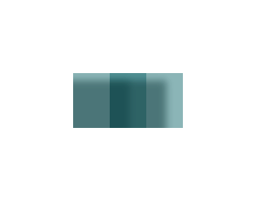
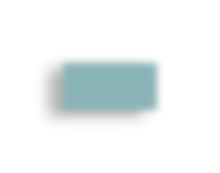
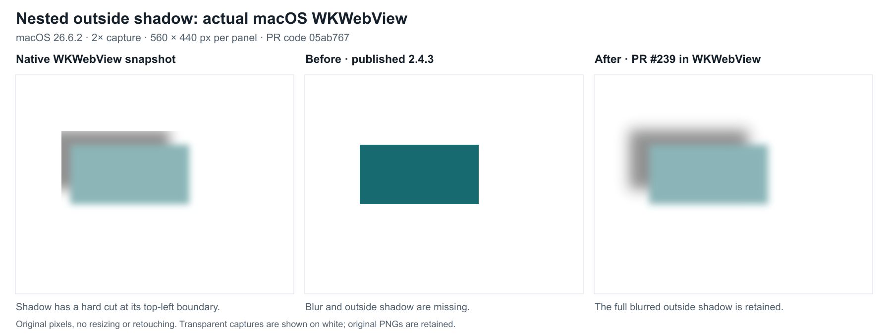
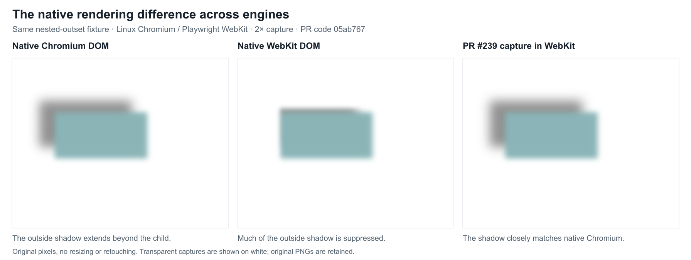

# Draft: compositing CSS filters on an intermediate surface

This draft includes a production native Canvas filter path with SVG fallback,
an interactive demo and a separate test-only prototype. It does not change the
public API. PR #239 remains Draft; the original 2.4.3 release does not include
these changes.

For current user-facing behavior, see [CSS filters and layer opacity](./filter-support.md).
For the native backend, validation and measured remaining performance limits,
see [the production fast-path report](./filter-native-fastpath.md). Historical
experiments below retain their original measurements; they are not current-run
performance claims. The nested outside-shadow policy was accepted by the
maintainer on 16 September 2026, as recorded in the discrepancy section below.

The base is `60cb8bdd925fd7c56cd423d6e2127da177a97279` (version 2.4.3).

## Reproduce

1. Run `pnpm install` and `pnpm build`.
2. Run `pnpm exec tsx tests/server --port=8091 --cors=8092`.
3. Open `/tests/reftests/filter/compositing.html?run=false` on that server.
4. Remove `?run=false` to use the standard DOM/capture comparison.
5. Add `?run=false&prototype` to compare with the test-only SVG filter path.

The fixture uses local HTML and inline SVG only. It requires no application,
account, external image, web font, or proprietary asset.

## Interactive HTML demo

Open `/tests/manual/filter-lab.html` on the same local server. The page provides:

- Four sources: a CTA with text, overlapping HTML children, inline SVG and a local raster image.
- Sliders for blur, layer opacity, shadow blur and positive/negative shadow offsets.
- Eight presets covering every on/off combination of blur, shadow and 50% opacity.
- Live DOM, published 2.4.3 (before) and draft PR #239 (after), plus transparent PNG downloads.
- A full preset matrix at 1x or 2x, runtime capability detection and a JSON report download.

The page tests actual Canvas blur behavior instead of inferring it from a user
agent string. Safari and WebKit-based webviews are a compatibility focus, but the
compositing bugs are not exclusive to webviews: Chromium reproduces them too.
A genuine macOS WKWebView host has also been tested, as documented below;
iOS devices and Android WebView hosts have not been tested directly.
The [Canvas filter documentation](https://developer.mozilla.org/en-US/docs/Web/API/CanvasRenderingContext2D/filter)
and [WebKit implementation tracker](https://bugs.webkit.org/show_bug.cgi?id=198416)
provide context; runtime support still needs to be checked on the target device.

The before column imports the unmodified published `html2canvas-pro@2.4.3` ESM
bundle through an exact dev-dependency alias, with its integrity pinned in the
lockfile. `pnpm build` copies it to ignored `build/` for the demo; it is not included
in the library's published `dist/` package. The after column uses this branch's
normal renderer. Both receive the same DOM, dimensions, scale and stylesheet
readiness hook. No effects are removed from either capture. Examples without
effects provide a control and should match. The separate SVG prototype remains
available in the minimal reproduction and pixel probe.

The default overlapping-children example shows the combined defect immediately.
The matrix keeps all eight presets for each source, so reviewers can inspect
individual effects as well as combinations.

The demo does not upload results or fetch external assets. The first comparison
runs automatically after the page and renderer load. Subsequent captures are
explicit; changing controls invalidates previous playground output. Capture
failures clear stale downloads and leave the controls available for retry.

The hosted demo exposed a clone stylesheet race that fast local responses hid.
The clone's initial load can complete before adopted stylesheet links load,
turning a 280 × 220 fixture into an unstyled, wide text line. Both demo capture
paths now await cloned stylesheets and fonts in `onclone`, then verify that the
fixture kept its size. A stylesheet failure produces an error instead of a
misleading successful PNG. This is a demo safeguard; general stylesheet readiness
in the document cloner remains separate from the filter renderer integration.

The manual demo was exercised in Chromium 148 and Playwright WebKit 26.4 across
128 source/preset/scale combinations. After-renderer center alpha matched 128 for
50% opacity and 255 for fully opaque presets. Native screenshot comparisons had
mean absolute RGB error below 3/255 for each combination; this is a tolerance,
not pixel equality. Zero opacity, negative offsets, capture failure/retry and
viewport widths 320, 390, 720 and 1440 pixels were also checked. The WebKit runtime
reported unavailable Canvas blur, while Chromium reported working Canvas blur.

## Published-release before/after evidence

The actual published 2.4.3 bundle was compared with the draft in Chromium 148
and Playwright WebKit 26.4: 4 sources × 8 presets × 2 scales × 2 engines.
All 128 after captures passed native DOM screenshot comparisons (mean RGB error
below 0.39/255 in Chromium and 1.19/255 in WebKit); no-effects baseline controls also passed. The combined overlap
center changed from alpha 239 to 128 at 1x in both engines, as expected for 50%
opacity. The regression probe explicitly checks this baseline defect and its fix.

These are real macOS Safari 26.5.2 screenshots of the local demo, captured through the
native browser UI at 1x capture scale. In this runtime Canvas 2D blur is unavailable.
Left: native DOM; center: unmodified published 2.4.3; right: draft PR #239.

Safari visually reproduced the missing blur and darkened overlap before the fix.
The after column retained blur and the expected 0.50 center alpha. These desktop
Safari checks do not establish correctness in an embedded WKWebView host.

## Pixel probe

Run `node scripts/filter-compositing-probe.mjs` for an automated Chromium
comparison at 1x and 2x. Set `CHROME_BIN` if using an installed Chrome instead of
Puppeteer's downloaded browser. Screenshots and metrics go to the ignored
`tmp/filter-compositing-probe/` directory. The probe checks the renderer against
native DOM screenshots, plus nested opacity, source/ancestor clipping and the
still-unfixed SVG overflow case.
It also delays uncached demo stylesheets, checks automatic capture and all eight
combinations at 1x/2x, and verifies failed stylesheet loading followed by retry.

## Cases

- An inline SVG with a CSS drop shadow must retain pixels outside its content box.
- Two overlapping children with a parent blur must be filtered as one image.
- Parent blur, drop shadow and 50% opacity must not darken the children's overlap.
- An inline SVG with visible overflow must retain the outside half of its stroke.
  This last case is reproduced only; the prototype does not fix SVG bounds.

In the 2.4.3 baseline, `EffectsRenderer` applies filter and opacity state to individual canvas
draws. `renderReplacedElement` clips its draw to the element's padding box. These
operations do not provide an intermediate surface for the complete filtered
subtree. In addition, assigning `ctx.filter` cannot provide blur on engines that
do not implement Canvas 2D filters.

## Initial renderer integration

`CanvasRenderer` rasterizes eligible filter/opacity stacking contexts on an
intermediate surface. It applies blur followed by one shadow, then opacity, and
composites the result in z-order. Source effects stop at the surface boundary, so
ancestor and nested opacity do not get applied twice. Capture bounds gain padding
for blur and signed shadow offsets.

The production helper now checks actual native blur and colored shadow pixels,
uses Canvas filters where that probe succeeds, and retries SVG for recoverable
native failures. Both backends apply layer opacity after filtering. Opacity-only
layers skip the probe. This backend selection is separate from surface eligibility:
returning to SVG preserves layer composition, while returning to the previous
subtree renderer does not gain the new compositing guarantees.

This first integration only handles untransformed subtrees without non-normal
mix-blend-mode, non-unit zoom, list markers or clip-path. Relevant ancestors are
checked too. Unsupported filter chains, including `blur(5px) brightness(2)`,
reversed shadow/blur order and multiple drop shadows, retain the existing renderer
path. CSS `opacity` is supported separately; `filter: opacity(...)` is outside the
subset. See [supported combinations and fallback behavior](./filter-support.md).
Nested opacity and filters, ancestor clipping and clipping before blur have focused
checks. SVG paint bounds, general filter chains and transformed/blended surfaces
remain outside this scope.

Filter parsing also preserves units and functional colors: `blur(5px)` no longer
becomes `blur(5pxpx)`, hue-rotate no longer duplicates its unit, and nested rgba/rgb
color functions retain their arguments. Non-empty filters create a real stacking
context.

The 128 demo comparisons were rerun against the initial integrated renderer. Both renderer
and prototype stayed below 0.39/255 mean absolute RGB error in Chromium and
1.19/255 in WebKit. Center alpha matched every expected 50% / 100% preset. Two
nested 50% opacities produced alpha 64 in both engines. These results do not prove
arbitrary-page equivalence.

The initial integrated build, lint, 1,195 unit tests and 113 Chrome reftests passed. The
committed pixel probe also passed in Chrome 152 at 1x and 2x. The Karma suite
checks successful rendering, not pixel equivalence; the probe checks pixels for
the focused filter fixtures. Later validation and measurements are recorded in the
[production native fast-path report](./filter-native-fastpath.md).

## Prototype

`tests/manual/filter-compositing.js` captures one untransformed layer without its
parent filter and opacity. It applies blur followed by a single drop shadow to
the raster via SVG, then applies opacity while compositing the result. Both
engines exercise this SVG path; it does not depend on Canvas 2D filter support.

The shadow uses Gaussian blur, offset, flood and composite primitives, rather
than `feDropShadow`. Filters use capture-pixel coordinates and sRGB. The SVG
contains an embedded PNG, with no `foreignObject` or external resource.

The experiment deliberately uses known fixture parameters and generous bounds.
It is not a general filter parser or a production wrapper around html2canvas.

## Initial measurements

The fixtures were checked against native DOM screenshots in Chromium 148 and
Playwright WebKit 26.4, at both 1x and 2x. The SVG path ran in both engines.

Mean absolute RGB error on a white background, per channel on a 0–255 scale:

| Case                    | Chromium baseline → prototype | WebKit baseline → prototype |
| ----------------------- | ----------------------------- | --------------------------- |
| SVG shadow              | 4.54–4.57 → less than 0.001   | 4.29–4.32 → 0.52–0.60       |
| Parent blur             | 3.34–3.67 → 0.015             | 3.33–3.96 → 0.096–0.097     |
| Blur + shadow + opacity | 11.25–12.14 → 0.075–0.081     | 11.24–12.01 → 0.27–0.30     |

The combined fixture's overlapping center has alpha 239–240 in the baseline
capture, versus 128 in the prototype (expected 50%). Outside SVG shadow pixels
have alpha 0 in the baseline capture and 73–74 in the prototype. These are focused
fixture results, not a claim of general rendering equivalence or a full Safari UI
test. The native WebKit shadow discrepancy is documented separately below.

## Surface bounds, errors and cleanup

If native filtering is unavailable or fails recoverably, the SVG backend is tried
on the completed surface. When that SVG path cannot serialize tainted pixels,
CSP blocks its data image, or decoding fails, the affected subtree returns to the
previous renderer. A working native path does not need a data image and can retain
surface composition under such a CSP. This preserves `allowTaint`: a permitted
cross-origin image still returns a canvas whose pixel reads raise `SecurityError`.
Abort remains an `AbortError`; it interrupts a stalled decoder promptly and is
never converted to fallback. SVG decode waits have a 10-second ceiling.

Temporary canvas backing stores are cleared on success, failure and abort. Failed
internally allocated output canvases are cleared; caller-supplied canvases remain
caller-owned. Clone cleanup runs in `finally`, preserving `removeContainer: false`.

Surfaces use conservative subtree bounds: overflow descendants, text ink padding,
box/text shadows and nested filter outsets. Capture crops include nearby pixels
that contribute through signed offsets or blur. Each capture shares a reservation
of 16,777,216 intermediate raster pixels (64 MiB of RGBA), counting four rasters per
active surface conservatively, with sides capped at 8,192 pixels. This bounds
intermediate backing stores, not the caller's output or browser encoder overhead.
Over-budget subtrees use the previous path before allocation, without downscaling.
Outset box shadows inside a source surface use a visible silhouette and the same
filter helper, which selects native filtering or SVG. Linux WebKit lost the interior
of shadows from off-canvas Canvas masks; a smaller displacement did not fix it.
The silhouette path shares the capture budget and cleanup. An even-odd clip preserves
the rounded border-box cutout without reversing Bezier curves. Tests cover transparent
rounded boxes, multiple box shadows, signed offsets and negative spread at 1x/2x.
Inset shadows retain the previous path, with capture-scaled metrics in a source surface.

`node scripts/filter-surface-regressions.mjs` checks Chromium/WebKit pixels at
1x/2x, z-order, nested signed outsets, overflowing text and box shadows, offset
crops, transformed/rotated/zoomed/blended/clipped ancestors and descendants,
unsupported filter chains, real taint, CSP, decoder failure, abort and cleanup.
Unsupported subtrees are compared with the published release. Explicit SVG/CSP
fallback checks use the current legacy path, preserving the separate parser fixes;
working native behavior under blocked data-image CSP is checked separately.

`node scripts/filter-surface-benchmark.mjs` records allocations and timings.
Historical Chromium/WebKit measurements on macOS 26.5.2:

| Fixture                              | Peak intermediate canvas backing stores | Retained after capture |
| ------------------------------------ | --------------------------------------: | ---------------------: |
| 50 small layers, 2400 × 1600 capture |                           269,568 bytes |                      0 |
| 40 nested filters                    |                        17,352,208 bytes |                      0 |
| Over-budget 2600 × 2600 capture      |                     0 (legacy fallback) |                      0 |

The sparse case uses 216 × 156 surfaces instead of a capture-sized canvas per
layer. Timings are reported, not used as flaky CI thresholds. Canvas instrumentation
does not measure the internal SVG decoder; the shared reservation includes an
allowance for those image rasters.

## Real embedded WKWebView

Run `node scripts/wkwebview-probe.mjs` on macOS with Xcode command line tools,
after installing dependencies and running `pnpm build`.
It compiles a minimal AppKit host embedding a genuine `WKWebView`, takes native
snapshots and captures the same fixtures with both library versions. It does not
substitute Safari automation or Playwright WebKit for the native host. Runtime,
scale, screenshots and measurements are retained in `tmp/wkwebview-probe/`.

In macOS WKWebView 26.5.2, without Canvas 2D filters, the combined blur/shadow/opacity,
z-order and source text/box-shadow cases stayed below 0.50/255 mean RGB error at
1x/2x. The combined overlap had alpha 128. This proves the minimal macOS host,
not an iOS device or another application's WKWebView configuration.

| Native WKWebView                                                     | Published 2.4.3                                                      | Draft PR                                                           |
| -------------------------------------------------------------------- | -------------------------------------------------------------------- | ------------------------------------------------------------------ |
|  |  |  |

### Native WebKit discrepancy

The following figures show the exact `nested-outset` case from the passing CI run
for code revision `05ab767`. Each panel retains the original 2× capture pixels;
transparent PNGs are presented on white for comparison.

[Download original PNGs and view their provenance](./assets/filter-compositing/nested-shadow/README.md).

The live WebKit reference loses or clips an outside shadow nested under another
filtered element. The discrepancy differs between Playwright WebKit 26.4 and
system WKWebView 26.5.2. The draft retains the specified shadow and improves the
release, but does not match these native references exactly:

| Nested outside shadow    | Published 2.4.3 MAE |      Draft MAE |
| ------------------------ | ------------------: | -------------: |
| Playwright WebKit, 1x/2x |     about 12.15/255 | about 4.10/255 |
| System WKWebView, 1x/2x  |     about 13.91/255 |  2.05–2.24/255 |

The report marks this case `nativeShadowDiscrepancy`. The portable WebKit probe
compares this fixture with the independently captured Chromium DOM using the same
2/255 threshold, and checks retained outside-shadow pixels. A release-relative
ratio is unsuitable across platforms with different Canvas filter support. Native
WebKit and baseline errors remain recorded. The macOS host additionally requires
a twofold error reduction versus its release capture. These gates are explicitly
separate from the native WebKit threshold for the other cases.
Do not describe it as pixel-equivalent to native WebKit. In the
[16 September 2026 maintainer review](https://github.com/yorickshan/html2canvas-pro/pull/239#issuecomment-5694372459),
preserving the complete shadow and documenting this native difference was accepted.
This is an accepted rendering policy, not a resolution of all remaining PR work.

## Readiness checklist

- [x] Preserve taint/CSP behavior; verify decoder errors, cancellation and resource cleanup.
- [x] Crop and budget surfaces; measure large, sparse and nested captures.
- [x] Add z-order, signed-outset, text/shadow and unsupported-subtree regressions; record the native WebKit discrepancy explicitly.
- [x] Add CI jobs for the committed pixel probe, Chromium/WebKit regressions and allocation benchmarks, with retained artifacts.
- [x] Add and run a real macOS WKWebView host at 1x/2x.
- [x] Cover unitless blur and descriptor edge cases.
- [x] Measure SVG cost and add a validated production native Canvas fast path with SVG fallback.
- [x] Document the surface subset, examples and distinct fallback guarantees in the user-facing guide.
- [x] Record maintainer acceptance of the nested outside-shadow policy.

CI execution and publication dependencies are defined by the committed workflows;
check the actual PR revision's CI status separately. General filter chains,
multiple drop shadows, transformed/blended surfaces, SVG overflow and library-wide
stylesheet readiness remain potential follow-ups. The measured over-budget legacy
performance gap and remaining SVG cost are described in the native fast-path report.
The demo continues to guard cloned stylesheet readiness in `onclone`.

The related shadow report #223 was marked fixed in 2.3.2. This draft supplies
separate fixtures against 2.4.3; it does not assume that report has the same cause.

AI-assisted investigation and implementation.
